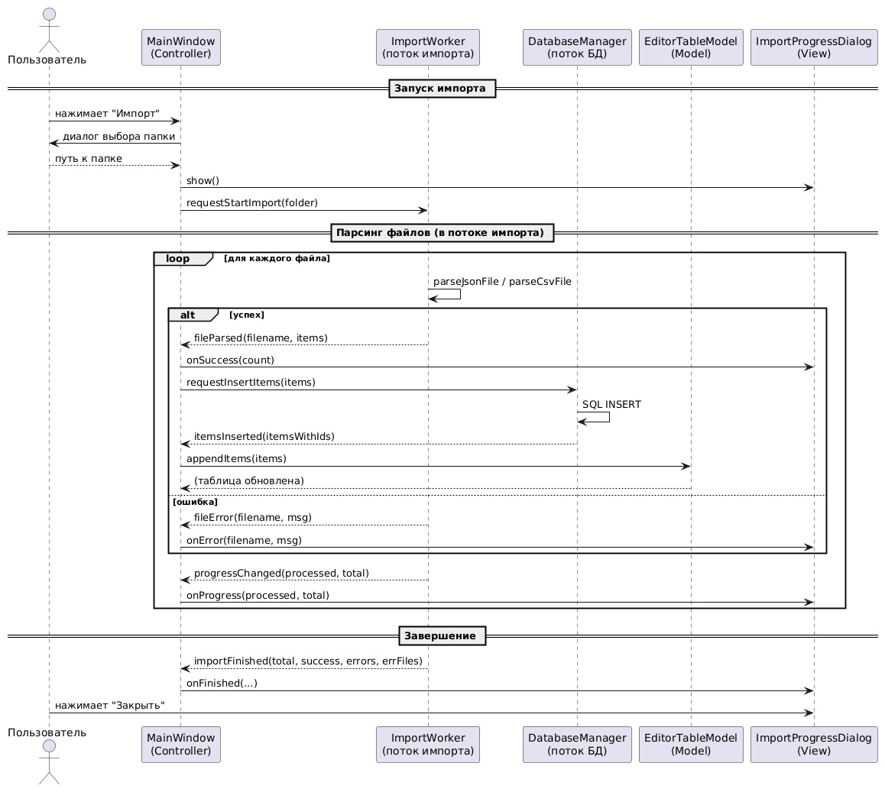

# Тестовое задание СТЦ

## Описание

Графическое приложение на Qt5 для импорта, просмотра, редактирования и экспорта данных о текстовых редакторах из JSON и CSV файлов. Приложение использует архитектуру MVC (Model-View-Controller) и работает с базой данных SQLite.

## Архитектура



Приложение построено по паттерну MVC:
- **Model**: `EditorTableModel` - кастомная табличная модель данных
- **View**: `QTableView` - отображение данных в табличной форме
- **Controller**: `MainWindow` - координация между компонентами

Работа с базой данных и импорт файлов выполняются в отдельных потоках для обеспечения отзывчивости интерфейса.

## Требования

- Qt 5
- C++14
- qmake
- SQLite

## Сборка и запуск

```bash
# Клонирование репозитория
git clone https://github.com/VladelProg/BD_STC_INTER
cd BD_STC_TEST

# Сборка
qmake BD_STC_TEST.pro
make

# Запуск
./BD_STC_TEST
